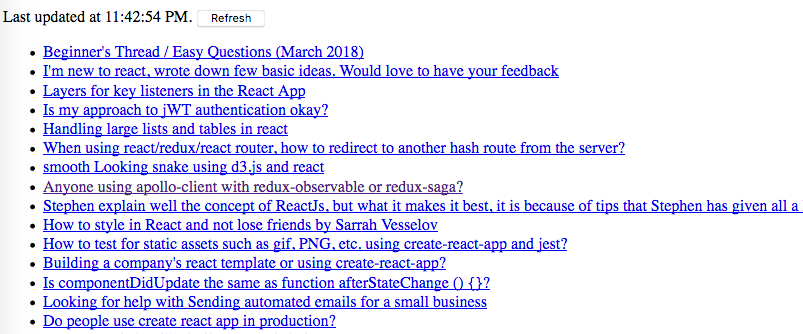
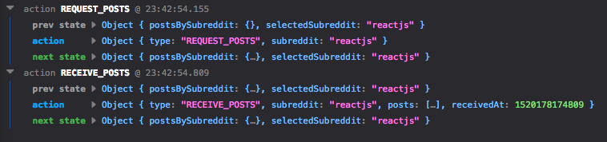
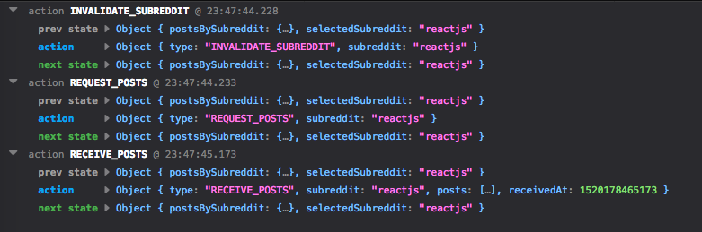

> 老徐
>
> Sunday, 4 March 2018
>
> React 快速入门，以一个具体的`异步获取数据`的实验，白话讲一讲 React 的相关基本概念。
>
> 说错了不要见笑，欢迎指正！


# React Redux Quick Start

&emsp;&emsp;React 起源于 Facebook 的内部项目，因为该公司对市场上所有 JavaScript MVC 框架，都不满意，就决定自己写一套，用来架设 [Instagram](https://instagram.com/) 的网站。做出来以后，发现这套东西很好用，就在2013年5月[开源](http://facebook.github.io/react/blog/2013/06/05/why-react.html)了，2014年 Facebook 提出了 Flux 架构的概念，2015年 Redux 出现，Redux 由 Flux 演变而来，将 Flux 与函数式编程结合一起。Redux 用来进行状态管理，即你需要一种机制，可以在同一个地方查询状态、改变状态、传播状态的变化。

&emsp;&emsp;我们一般说的 React 是指用来写复杂单页应用程序（Single-Page-Application，SPA）的 React 全家桶，React 核心只是一个用来构造界面的UI库，如果要搭建大型或复杂的应用程序，必须搭配一系列的框架或叫中间件。

常用的中间件：

* `react-redux`/`mobx`：状态管理
* `react-router`：路由管理
* `redux-thunk`/`redux-saga`：异步操作


* `redux-logger`：日志打印

# 基础：

* 编程环境
  * JavaScript XML（JSX）：React 使用JSX来编写，需要Babel把JSX转化成JS
  * JavaScript ES6：新的 JS 语法规范
  * Babel：JS 代码编译器
  * Node.js：JS 运行环境
  * Yarn：JS 包管理器
  * WebPack：文件打包工具
* React 组件
  * 虚拟DOM：DOM diff，即虚拟 DOM 变化全部合并后有变化的才会反应到真实 DOM 上
  * this.props：属性，不变的数据
  * this.state：状态，变化的数据
* 状态管理
  * Flux：被 Redux 取代
  * Redux：取代 Flux， Store、Action、Reducer
  * React-Redux：专为 React 写的 Redux 库
* 异步操作
  * Redux-thunk
  * Redux-saga

- 路由管理
  - React-Router：

## 编程环境

&emsp;&emsp;React 使用`JavaScript XML（JSX）`来编写，JSX 是JS的扩展，可以混杂 HTML 和 JS 代码在一起写，为了书写方便等原因大多数都是`JavaScript ES6`标准来写 JS 代码，但是浏览器可能不兼容 ES6 标准而只兼容 ES5 标准，因此需要 `Babel` 这个 JS  编译器来将 ES6 的代码编译为 ES5 的代码。

```jsx
ReactDOM.render(
    <div>
      <h1>{1+1}</h1>
    </div>
    ,
    document.getElementById('example')
);
```

> 上面的代码就是一段 JSX 语法的代码
>
> * 可以直接写 HTML 标签
> * 大括号里的内容表示是 JS 代码

&emsp;&emsp;一般来说为都是会在服务器端对 jsx 代码进行编译打包后生成单个的 js 文件供浏览器端加载，顺便说下不建议使用 jsx 扩展名请仍旧使用 js 扩展名，这里的编译工具就是 `babel`，它用来翻译 ES6 标准的 jsx 代码变成 ES5 的 js 代码，`webpack`则用来对多个文件进行打包后生成单个文件，`node.js`是服务端 js 的运行环境，`yarn` 则是代替 `npm` 的更好的 `node.js` 包管理工具，用来下载`react`、 `babel`、`webpack` 等所有我们需要用到的代码包。

**基本环境设置**：

Mac下安装 `node.js`推荐：

```bash
$ brew install node
$ node -v
v6.11.4
```

> Windows 等其他环境可以直接下载安装包或自行百度
>
> https://nodejs.org/en/download/

Mac下安装 `yarn`推荐：

```bash
$ brew install yarn
$ yarn -v
1.5.1
```

> Windows 等其他环境可以直接下载安装包或自行百度
>
> https://yarnpkg.com/lang/en/docs/install/

### create-react-app

> create-react-app 来自于 Facebook，通过该命令我们无需配置就能快速构建 React 开发环境。
>
> create-react-app 自动创建的项目基于 Webpack + ES6 。

使用 `create-react-app` 可以快速构建 React 开发环境

```bash
$ yarn global add create-react-app
```

之后我们就可以通过 create-react-app 来快速创建 react 环境

```bash
$ create-react-app my-app
```

你也可以使用`yarn create react-app`命令

```bash
$ yarn create react-app my-app
```

> 会安装或更新 create-react-app 到最新版本，然后调用 create-react-app

等价于

```bash
$ yarn global add create-react-app
$ create-react-app my-app
```

创建完毕后即可启动查看最终效果

```bash
$ yarn create react-app my-app
$ cd my-app
$ yarn install
$ yarn start
```

> 会自动打开浏览器访问 http://localhost:3000/ 来展示 React 效果
>
> 支持热部署，即你修改文件内容后无需重启

###JavaScript ES6

&emsp;&emsp;开始之前需要了解一些`JavaScript ES6`的基本语法，因为 react 项目基本上都是用ES6来写的，历时将近6年的时间来制定的新 ECMAScript 标准 ECMAScript 6（亦称 ECMAScript Harmony，简称 ES6）终于在 2015 年 6 月正式发布。自从上一个标准版本 ES5 在 2009 年发布以后，ES6 就一直以**新语法**、**新特性**的优越性吸引著众多 JavaScript 开发者，驱使他们积极尝鲜。由于ES6是在2015年发布的，所以也叫ES2015。

> 《ECMAScript 6入门》是一本开源的 JavaScript 语言教程，全面介绍 ECMAScript 6 新增的语法特性。<http://es6.ruanyifeng.com/>

**变量声明 const/let**

> 不要用 var，而是用 const 和 let，分别表示常量和变量。
>
> 不同于 var 的函数作用域，const 和 let 都是块级作用域。

**模板字符串 ${xxx}**

```js
const user = 'world';
console.log(`hello ${user}`);  // hello world

// 多行
const content = `
  Hello ${firstName},
  Thanks for ordering ${qty} tickets to ${event}.
`;
```

**默认参数**

```js
function logActivity(activity = 'default') {
  console.log(activity);
}

logActivity();
```

**箭头函数 =>**

> - 函数的快捷写法，不需要通过 function 关键字创建函数，并且还可以省略 return 关键字。
>
>
> - 同时，箭头函数还会继承当前上下文的 this 关键字。

```js
[1, 2, 3].map(x => x + 1);  // [2, 3, 4]
```

等同于

```js
[1, 2, 3].map((function(x) {
	  return x + 1;
	}).bind(this));
```

函数变量

```js
const mapStateToProps = state => {
  ...
}
```

**析构赋值**

> 析构赋值让我们从 Object 或 Array 里取部分数据存为变量。

```js
// 对象
const user = { name: 'guanguan', age: 2 };
const { name, age } = user;
console.log(`${name} : ${age}`);  // guanguan : 2

// 数组
const arr = [1, 2];
const [foo, bar] = arr;
console.log(foo);  // 1

// 我们也可以析构传入的函数参数。
const add = (state, { payload }) => {
	return state.concat(payload);
};

// 析构时还可以配 alias，让代码更具有语义。
const add = (state, { payload: todo }) => {
	return state.concat(todo);
};
```

**对象字面量改进**

> 这是析构的反向操作，用于重新组织一个 Object 。

```js
const name = 'duoduo';
const age = 8;

const user = { name, age };  // { name: 'duoduo', age: 8 }

// 定义对象方法时，还可以省去 function 关键字。
app.model({
  reducers: {
    add() {}  // 等同于 add: function() {}
  },
  effects: {
    *addRemote() {}  // 等同于 addRemote: function*() {}
  },
});
```

**模块的 Import 和 Export**

```js
// 引入全部
import dva from 'dva';

// 引入部分
import { connect } from 'dva';
import { Link, Route } from 'dva/router';

// 引入全部并作为 github 对象
import * as github from './services/github';

// 导出默认
export default App;
// 部分导出，需 import { App } from './file'; 引入
export class App extend Component {};
```

**三点操作**

> Spread Operator 即 3 个点 ...，有几种不同的使用方法。

数组相关

```js
// 可用于组装数组。
const todos = ['Learn dva'];
[...todos, 'Learn antd'];  // ['Learn dva', 'Learn antd']

// 可用于获取数组的部分项。
const arr = ['a', 'b', 'c'];
const [first, ...rest] = arr;
rest;  // ['b', 'c']

// 忽略某个项
const [first, , ...rest] = arr;
rest;  // ['c']
```

函数相关

```js
// 可收集函数参数为数组。
function directions(first, ...rest) {
  console.log(rest);
}
directions('a', 'b', 'c');  // ['b', 'c'];

// 代替 apply。
function foo(x, y, z) {}
const args = [1,2,3];

// 下面两句效果相同
foo.apply(null, args);
foo(...args);
```

对象相关

```js
// 对于 Object 而言，用于组合成新的 Object 。(ES2017 stage-2 proposal)
const foo = {
  a: 1,
  b: 2,
};
const bar = {
  b: 3,
  c: 2,
};
const d = 4;

const ret = { ...foo, ...bar, d };  // { a:1, b:3, c:2, d:4 }
// 注意，上面第一个 b 被第二个 b 给覆盖了
```

JSX 相关

```jsx
// 在 JSX 中 Spread Operator 还可用于扩展 props，详见 Spread Attributes。
// 这是 JSX 从 ECMAScript6 借鉴过来的很有用的特性，用于扩充组件 props 。
const attrs = {
  href: 'http://example.org',
  target: '_blank',
};
<a {...attrs}>Hello</a>	
```

等同于

```jsx
const attrs = {
  href: 'http://example.org',
  target: '_blank',
};
<a href={attrs.href} target={attrs.target}>Hello</a>
```

## React 组件

### HelloWorld

> 一个最简单的 React 组件，直接在浏览器中打开即可查看效果

helloworld.html

```html
<!DOCTYPE html>
<html lang="en">
<head>
    <meta charset="UTF-8">
    <title>HelloWorld</title>
    <script src="https://cdn.bootcss.com/react/15.5.4/react.min.js"></script>
    <script src="https://cdn.bootcss.com/react/15.5.4/react-dom.min.js"></script>
    <script src="https://cdn.bootcss.com/babel-standalone/6.22.1/babel.min.js"></script>
</head>
<body>
    <div id="root"></div>
    <script type="text/babel">
        var MyComponent = React.createClass({
            render(){
                return (
                    <div>我是{this.props.name}
                        <h4>react 组件名 首字母大写</h4>
                    </div>
                )
            }
        });

        ReactDOM.render(
                <MyComponent name="ABC"/>,
                document.getElementById("root")
        )
    </script>
</body>
</html>
```

> 引用的 js 库
>
> - react.min.js - React 的核心库
> - react-dom.min.js - 提供与 DOM 相关的功能
> - babel.min.js - Babel 可以将 ES6 代码转为 ES5 代码，这样我们就能在目前不支持 ES6 浏览器上执行 React 代码。
>
> JSX代码
>
> * `<script type="text/babel">`表示是 JSX 代码
>
> Render
>
> * ReactDOM.render 会把React组件的内容输出到对应的 HTML Element 中

注意

> * 组件类的第一个字母必须大写，否则会报错，比如`HelloMessage`不能写成`helloMessage`。
> * 另外，组件类只能包含一个顶层标签，否则也会报错。

### this.props

> 组件属性，在组件外赋值，在组件内通过 this.props.xxx 读取的只读属性

组件的用法与原生的 HTML 标签完全一致，可以任意加入属性，比如 `<HelloMessage name="John">` ，就是 `HelloMessage` 组件加入一个 `name` 属性，值为 `John`。组件的属性可以在组件类的 `this.props` 对象上获取，比如 `name` 属性就可以通过 `this.props.name` 读取。

注意

> * `class` 属性需要写成 `className` 
> * `for` 属性需要写成 `htmlFor` ，这是因为 `class` 和 `for` 是 JavaScript 的保留字。

### this.state

> 组件状态，理解为会变化内容的属性，在组件内通过 this.state.xxx 读取

React Component 有好几种写法，建议使用 extends Component 方式

```jsx
<!DOCTYPE html>
<html lang="en">
<head>
    <meta charset="UTF-8">
    <title>HelloWorld</title>
    <script src="https://cdn.bootcss.com/react/15.5.4/react.min.js"></script>
    <script src="https://cdn.bootcss.com/react/15.5.4/react-dom.min.js"></script>
    <script src="https://cdn.bootcss.com/babel-standalone/6.22.1/babel.min.js"></script>
</head>
<body>
    <div id="root"></div>
    <script type="text/babel">
        class LikeButton extends React.Component {
          constructor(props) {
            super(props);
            this.handleClick = this.handleClick.bind(this);
          }

          state = { liked: true }

          handleClick(event) {
            this.setState({ liked: !this.state.liked });
          }

          render() {
            var text = this.state.liked ? '喜欢' : '不喜欢';
            return (
              <p onClick={this.handleClick}>
                你<b>{text}</b>我。点我切换状态。
              </p>
            );
          }
        }

        ReactDOM.render(
                <LikeButton />,
                document.getElementById("root")
        )
    </script>
</body>
</html>
```

> 这是最爽的部分：
>
> * 只要修改了状态（这里的 this.setState）值，那么界面会随之刷新
> * React 会计算DOM的变化（Diff算法），然后高效地更新在浏览器中显示的DOM。
> * 这允许程序员编写代码时的每一次修改，整个页面好像都会重新渲染，而实际上React库只渲染实际改变的子组件。

## 状态管理

> 你需要一种机制，可以在同一个地方查询状态、改变状态、传播状态的变化。

&emsp;&emsp;简单说，状态管理是一种架构思想，用于将业务逻辑从用户界面中分离出来，专门解决软件的结构问题。它跟MVC 架构是同一类东西，但是更加简单和清晰。

&emsp;&emsp;2014年 Facebook 提出了 Flux 架构的概念，2015年 Redux 出现，Redux 是由 Flux 演变而来，将 Flux 与函数式编程结合一起。之后又出现了Mobx用来取代 Flux，不过目前多数人使用的是 `Redux`。

> 首先明确一点，Redux 是一个有用的架构，但不是非用不可。
>
> 事实上，大多数情况，你可以不用它，只用 React 就够了。
>
> 另一方面，Redux 只是 Web 架构的一种解决方案，也可以选择其他方案。

### Redux

**基本概念**

- Store：数据，整个应用只能有一个 Store
- State：状态，某个时刻 Store 的快照
- Action：动作，用来分离 View 和 Store，获取数据等，负责给 Reducer 传递数据
- Reducer：处理，用来定义数据模型，每个数据项定义了对应各个 Action 应该如何处理数据

**工作流程**

* 首先，用户发出 Action
* 然后，Store 自动调用 Reducer，并且传入两个参数：当前 State 和 Action。 Reducer 会返回新的 State 。
* 如果 State 有变化，Store 就会调用监听函数，这个监听函数一般是 `ReactDOM.render`

> 具体内容见后面的 `实验`

### React-Redux

为了方便使用，Redux 的作者封装了一个 React 专用的库 [React-Redux](https://github.com/reactjs/react-redux)。

> 这个库是可以选用的。
>
> 实际项目中，你应该权衡一下，是直接使用 Redux，还是使用 React-Redux。
>
> 后者虽然提供了便利，但是需要掌握额外的 API，并且要遵守它的组件拆分规范。

**基本概念**

React-Redux 将所有组件分成两大类：

- UI 组件（Presentational Component）：负责 UI 的呈现
- 容器组件（Container Component）：负责管理数据和逻辑。

> React-Redux 规定，所有的 UI 组件都由用户提供，容器组件则是由 React-Redux 自动生成。也就是说，用户负责视觉层，状态管理则是全部交给它。

**API**

- `connect`，用于为 UI 组件生成相应的容器组件。
- `mapStateToProps()`
  - `connect` 的第一个参数，可选
  - 建立一个从（外部的）`state`对象到（UI 组件的）`props`对象的映射关系。
  - 会订阅 Store，每当`state`更新的时候，就会自动执行，重新计算 UI 组件的参数，从而触发 UI 组件的重新渲染。
- `mapDispatchToProps()`
  - `connect` 的第二个参数，可选

**其他**

- `<Provider>` 最外层的容器组件，用于让子组件拿到 store 或者说 state

> 具体内容见后面的 `实验`

## 异步操作

> React 中如何异步获取数据后刷新界面？

* Action 发出以后，Reducer 立即算出 State，这叫做同步；
* Action 发出以后，过一段时间再执行 Reducer，这就是异步。

**中间件 applyMiddleware**

> 怎么才能 Reducer 在异步操作结束后自动执行呢？这就要用到新的工具：中间件（middleware）。

中间件就是一个函数，对`store.dispatch`方法进行了改造，在发出 Action 和执行 Reducer 这两步之间，添加了其他功能。

常用的中间件：

* redux-logger：日志
* redux-thunk：异步

**异步操作的思路**

* 操作开始时，送出一个 Action，触发 State 更新为"正在操作"状态，View 重新渲染
* 操作结束后，收到数据，再送出一个 Action，触发 State 更新为"操作结束"状态，View 再一次重新渲染

> 具体内容见后面的 `实验`

# 实验

## 异步操作

> 完整的 React-Redux 异步操作获取数据刷新页面：
>
> * 异步刷新获取 reddit 的数据并显示
> * https://www.reddit.com/r/reactjs.json

### 项目环境

首先使用 `create-react-app` 快速构建项目环境

```bash
$ yarn create react-app react-redux-async
$ cd react-redux-async
$ yarn install
```

删除 src 目录下的所有文件

```bash
$ rm -rf src
```

加入 redux 和相关依赖

```bash
$ yarn add redux react-redux redux-thunk
$ yarn add --dev redux-logger
```

> redux-logger 用于打印日志

最终的目录结构

```bash
react-redux-async
  package.json
 -public
    index.html                
 -src
    -actions
       index.js               Actions
    -components
       Posts.js               组件 Posts
    -containers
       App.js                 组件 App
    -reducers
       index.js               Rducers
    index.js                  入口
  yarn.lock
```

### 入口

src/index.js

```jsx
import React from 'react'
import { render } from 'react-dom'
import { createStore, applyMiddleware } from 'redux'
import { Provider } from 'react-redux'
import thunk from 'redux-thunk'
import { createLogger } from 'redux-logger'

import reducer from './reducers'
import App from './containers/App'

const middleware = [ thunk ]
if (process.env.NODE_ENV !== 'production') {
  middleware.push(createLogger())
}

const store = createStore(
  reducer,
  applyMiddleware(...middleware)
)

render(
  <Provider store={store}>
    <App />
  </Provider>,
  document.getElementById('root')
)
```

> 引入了中间件，`redux-thunk`  和 `redux-logger`，注意 redux-logger 必须是最后一个中间件
>
> 创建了 redux 的核心部分，即 store，store 关联了 reducer 以及中间件
>
> 最外层引入了 react-redux 自带的容器组件 `Provider`，用于给子组件提供 store 或 state
>
>  `Provider`的子组件是我们程序的组件`App`

###组件`App`

src/containers/App.js

```jsx
import React, { Component } from 'react'
import PropTypes from 'prop-types'
import { connect } from 'react-redux'
import { fetchPostsIfNeeded, invalidateSubreddit } from '../actions'
import Posts from '../components/Posts'

class App extends Component {
  static propTypes = {
    selectedSubreddit: PropTypes.string.isRequired,
    posts: PropTypes.array.isRequired,
    isFetching: PropTypes.bool.isRequired,
    lastUpdated: PropTypes.number,
    dispatch: PropTypes.func.isRequired
  }

  componentDidMount() {
    const { dispatch, selectedSubreddit } = this.props
    dispatch(fetchPostsIfNeeded(selectedSubreddit))
  }

  handleRefreshClick = e => {
    e.preventDefault()

    const { dispatch, selectedSubreddit } = this.props
    dispatch(invalidateSubreddit(selectedSubreddit))
    dispatch(fetchPostsIfNeeded(selectedSubreddit))
  }

  render() {
    const { posts, isFetching, lastUpdated } = this.props
    const isEmpty = posts.length === 0
    return (
      <div>
        <p>
          {lastUpdated &&
            <span>
              Last updated at {new Date(lastUpdated).toLocaleTimeString()}.
              {' '}
            </span>
          }
          {!isFetching &&
            <button onClick={this.handleRefreshClick}>
              Refresh
            </button>
          }
        </p>
        {isEmpty
          ? (isFetching ? <h2>Loading...</h2> : <h2>Empty.</h2>)
          : <div style={{ opacity: isFetching ? 0.5 : 1 }}>
              <Posts posts={posts} />
            </div>
        }
      </div>
    )
  }
}

const mapStateToProps = state => {
  const { selectedSubreddit, postsBySubreddit } = state
  const {
    isFetching,
    lastUpdated,
    items: posts
  } = postsBySubreddit[selectedSubreddit] || {
    isFetching: true,
    items: []
  }

  return {
    selectedSubreddit,
    posts,
    isFetching,
    lastUpdated
  }
}

export default connect(mapStateToProps)(App)
```

**组件属性 props**

```jsx
  static propTypes = {
    selectedSubreddit: PropTypes.string.isRequired,
    posts: PropTypes.array.isRequired,
    isFetching: PropTypes.bool.isRequired,
    lastUpdated: PropTypes.number,
    dispatch: PropTypes.func.isRequired
  }
```

> 指明了组件属性的要求，比如是否必须，数据类型等
>
> 属性的数据来源是后面的 mapStateToProps 映射的结果

**初始化事件处理**

```jsx
  componentDidMount() {
    const { dispatch, selectedSubreddit } = this.props
    dispatch(fetchPostsIfNeeded(selectedSubreddit))
  }
```

> 将会在第一次创建组件时被自动调用
>
> 从属性中获取两个参数 dispatch, selectedSubreddit
>
> * dispatch：即 store.dispatch() 函数
> * selectedSubreddit：当前选中的reddit频道名称
>
> 然后发出 Action
>
> * dispatch(fetchPostsIfNeeded(selectedSubreddit))

**刷新按钮点击事件处理**

````jsx
 handleRefreshClick = e => {
    e.preventDefault()

    const { dispatch, selectedSubreddit } = this.props
    dispatch(invalidateSubreddit(selectedSubreddit))
    dispatch(fetchPostsIfNeeded(selectedSubreddit))
  }
````

> e.preventDefault() 方法将通知 Web 浏览器不要执行与事件关联的默认动作（如果存在这样的动作）
>
> 同样从属性中获取两个参数 dispatch, selectedSubreddit
>
> 连续发出两个Action
>
> * invalidateSubreddit 使得数据显示无效状态
> * fetchPostsIfNeeded 请求新数据

**组件渲染Render**

```jsx
  render() {
    const { posts, isFetching, lastUpdated } = this.props
    const isEmpty = posts.length === 0
    return (
      <div>
        <p>
          {lastUpdated &&
            <span>
              Last updated at {new Date(lastUpdated).toLocaleTimeString()}.
              {' '}
            </span>
          }
          {!isFetching &&
            <button onClick={this.handleRefreshClick}>
              Refresh
            </button>
          }
        </p>
        {isEmpty
          ? (isFetching ? <h2>Loading...</h2> : <h2>Empty.</h2>)
          : <div style={{ opacity: isFetching ? 0.5 : 1 }}>
              <Posts posts={posts} />
            </div>
        }
      </div>
    )
  }
```

> 从属性中获取三个参数 posts, isFetching, lastUpdated
>
> * 属性的数据来源是后面的 mapStateToProps 映射的结果
>
> 就是一个正常普通React组件的渲染代码
>
> 包括一个子组件 Posts

**mapStateToProps()**

```jsx
const mapStateToProps = state => {
  const { selectedSubreddit, postsBySubreddit } = state
  const {
    isFetching,
    lastUpdated,
    items: posts
  } = postsBySubreddit[selectedSubreddit] || {
    isFetching: true,
    items: []
  }

  return {
    selectedSubreddit,
    posts,
    isFetching,
    lastUpdated
  }
}
```

> `mapStateToProps`是一个数据映射函数。
>
> * 它的作用就是像它的名字那样，建立一个从`state`对象到`props`对象的映射关系。
> * 即从全局 Store 中取得数据传递给组件的 props
>
> 接收参数 state，即前面 store 的一个快照 `state = store.getState()`
>
> 从 state 中获取两个数据 selectedSubreddit、postsBySubreddit
>
> 即最后在 App 组件中可以使用的 this.props 包括
>
> ``````jsx
> {
> 	selectedSubreddit,
>     posts,
>     isFetching,
>     lastUpdated
> }
> ``````

**connect()**

```jsx
export default connect(mapStateToProps)(App)
```

> React-Redux 提供`connect`方法，用于从 UI 组件生成容器组件。

### 组件 Posts

/src/components/Posts.js

```jsx
import React from 'react'
import PropTypes from 'prop-types'

const Posts = ({posts}) => (
  <ul>
    {posts.map((post, i) =>
      <li key={i}><a target="_blank" href={post.url}>{post.title}</a></li>
    )}
  </ul>
)

Posts.propTypes = {
  posts: PropTypes.array.isRequired
}

export default Posts
```

> 非常简单的UI组件，显示一个列表

### Actions

> Actions 用来定义有哪些动作

src/actions/index.js

```jsx
export const REQUEST_POSTS = 'REQUEST_POSTS'
export const RECEIVE_POSTS = 'RECEIVE_POSTS'
export const SELECT_SUBREDDIT = 'SELECT_SUBREDDIT'
export const INVALIDATE_SUBREDDIT = 'INVALIDATE_SUBREDDIT'

export const invalidateSubreddit = subreddit => ({
  type: INVALIDATE_SUBREDDIT,
  subreddit
})

export const requestPosts = subreddit => ({
  type: REQUEST_POSTS,
  subreddit
})

export const receivePosts = (subreddit, json) => ({
  type: RECEIVE_POSTS,
  subreddit,
  posts: json.data.children.map(child => child.data),
  receivedAt: Date.now()
})

const fetchPosts = subreddit => dispatch => {
  dispatch(requestPosts(subreddit))
  return fetch(`https://www.reddit.com/r/${subreddit}.json`)
    .then(response => response.json())
    .then(json => dispatch(receivePosts(subreddit, json)))
}

const shouldFetchPosts = (state, subreddit) => {
  const posts = state.postsBySubreddit[subreddit]
  if (!posts) {
    return true
  }
  if (posts.isFetching) {
    return false
  }
  return posts.didInvalidate
}

export const fetchPostsIfNeeded = subreddit => (dispatch, getState) => {
  if (shouldFetchPosts(getState(), subreddit)) {
    return dispatch(fetchPosts(subreddit))
  }
}
```

> 这里定义了 4 个 Action：
>
> * REQUEST_POSTS  开始请求数据
> * RECEIVE_POSTS    收到请求的数据
> * SELECT_SUBREDDIT        
> * INVALIDATE_SUBREDDIT 使数据无效

首先是前面 App.js 中的初始化和刷新按钮事件调用的 fetchPostsIfNeeded 这个Action

**Action fetchPostsIfNeeded**

```jsx
export const fetchPostsIfNeeded = subreddit => (dispatch, getState) => {
  if (shouldFetchPosts(getState(), subreddit)) {
    return dispatch(fetchPosts(subreddit))
  }
}
```

> 这里是异步的关键，返回的不是平时的数据对象而是一个函数，该函数的参数是 (dispatch, getState)
>
> getState() 用于得到当前的数据快照即 state

```jsx
const shouldFetchPosts = (state, subreddit) => {
  const posts = state.postsBySubreddit[subreddit]
  if (!posts) {
    return true
  }
  if (posts.isFetching) {
    return false
  }
  return posts.didInvalidate
}
```

> 根据当前数据 state.postsBySubreddit 判断是否需要重新抓取 

```jsx
const fetchPosts = subreddit => dispatch => {
  dispatch(requestPosts(subreddit))
  return fetch(`https://www.reddit.com/r/${subreddit}.json`)
    .then(response => response.json())
    .then(json => dispatch(receivePosts(subreddit, json)))
}
```

> 抓取函数，该函数的参数是subreddit，返回一个函数指针，该函数的参数是 dispatch
>
> * 先执行 Action requestPosts 通知 Reducer 开始抓取
> * 然后执行抓取函数 fetch，并且在抓取完成后调用第二个 Action receivePosts 通知 Reducer 抓取完成

```jsx
export const requestPosts = subreddit => ({
  type: REQUEST_POSTS,
  subreddit
})
```

> Action requestPosts 通知 Reducer 开始抓取
>
> 参数 subreddit 为要抓取的频道名称

```jsx
export const receivePosts = (subreddit, json) => ({
  type: RECEIVE_POSTS,
  subreddit,
  posts: json.data.children.map(child => child.data),
  receivedAt: Date.now()
})
```

> Action receivePosts 通知 Reducer 抓取完成
>
> 参数 subreddit 为要抓取的频道名称
>
> 参数 posts 为取回的数据
>
> 参数 receivedAt 为当前时间

### Reducers

> Reducers 表示数据处理，用来定义数据模型，每个数据项定义了对应各个 Action 应该如何处理数据

```jsx
import { combineReducers } from 'redux'
import {
  REQUEST_POSTS, 
  RECEIVE_POSTS,
  SELECT_SUBREDDIT,
  INVALIDATE_SUBREDDIT
} from '../actions'

const selectedSubreddit = (state = 'reactjs', action) => {
  switch (action.type) {
    case SELECT_SUBREDDIT:
      return action.subreddit
    default:
      return state
  }
}

const posts = (state = {
  isFetching: false,
  didInvalidate: false,
  items: []
}, action) => {
  switch (action.type) {
    case INVALIDATE_SUBREDDIT:
      return {
        ...state,
        didInvalidate: true
      }
    case REQUEST_POSTS:
      return {
        ...state,
        isFetching: true,
        didInvalidate: false
      }
    case RECEIVE_POSTS:
      return {
        ...state,
        isFetching: false,
        didInvalidate: false,
        items: action.posts,
        lastUpdated: action.receivedAt
      }
    default:
      return state
  }
}

const postsBySubreddit = (state = { }, action) => {
  switch (action.type) {
    case INVALIDATE_SUBREDDIT:
    case RECEIVE_POSTS:
    case REQUEST_POSTS:
      return {
        ...state,
        [action.subreddit]: posts(state[action.subreddit], action)
      }
    default:
      return state
  }
}

const rootReducer = combineReducers({
  postsBySubreddit,
  selectedSubreddit
})

export default rootReducer
```

> 定义了 Store 共有两个数据项：
>
> * selectedSubreddit：当前选中的频道名称
> * postsBySubreddit：所有频道的数据

```jsx
const selectedSubreddit = (state = 'reactjs', action) => {
  switch (action.type) {
    case SELECT_SUBREDDIT:
      return action.subreddit
    default:
      return state
  }
}
```

> state.selectedSubreddit 当前选中的买到名称
>
> * 缺省值为 “reactjs”

```js
const postsBySubreddit = (state = { }, action) => {
  switch (action.type) {
    case INVALIDATE_SUBREDDIT:
    case RECEIVE_POSTS:
    case REQUEST_POSTS:
      return {
        ...state,
        [action.subreddit]: posts(state[action.subreddit], action)
      }
    default:
      return state
  }
}
```

> state.postsBySubreddit 所有频道的数据
>
> * 缺省值为 {}
>
> return 返回组合后的 state，所谓组合即后面的同名属性值会覆盖前面的，参考前面 JavaScript ES6 语法的对象相关部分。

```jsx
const posts = (state = {
  isFetching: false,
  didInvalidate: false,
  items: []
}, action) => {
  switch (action.type) {
    case INVALIDATE_SUBREDDIT:
      return {
        ...state,
        didInvalidate: true
      }
    case REQUEST_POSTS:
      return {
        ...state,
        isFetching: true,
        didInvalidate: false
      }
    case RECEIVE_POSTS:
      return {
        ...state,
        isFetching: false,
        didInvalidate: false,
        items: action.posts,
        lastUpdated: action.receivedAt
      }
    default:
      return state
  }
}
```

> * 缺省值
>
>   ```jsx
>   {
>     isFetching: false,
>     didInvalidate: false,
>     items: []
>   }
>   ```
>
> * 返回值
>
>   ```jsx
>   return {
>   	...state,
>   	isFetching: false,
>   	didInvalidate: false,
>   	items: action.posts,
>   	lastUpdated: action.receivedAt
>   }
>   ```
>
>   返回组合后的 state，所谓组合即后面的同名属性值会覆盖前面的，参考前面 JavaScript ES6 语法的对象相关部分。

### 运行效果

```bash
$ yarn start
```




有了 react-logger 可以清楚的在控制台看到 Action 的执行情况



点击刷新按钮时

