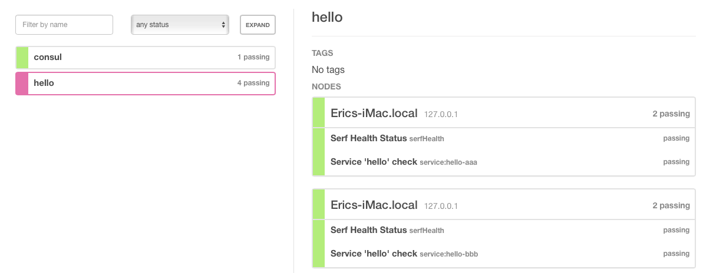

# Spring Cloud + Consul

&emsp;&emsp;`Spring Cloud` 为开发人员提供了快速构建分布式微服务系统的一些工具，包括配置管理、服务发现、断路器、路由、微代理、事件总线、全局锁、决策竞选、分布式会话等等。它运行环境简单，可以在开发人员的电脑上跑。另外`Spring Cloud`是基于`Spring Boot`的，所以需要开发中对`Spring Boot`有一定的了解。

**Spring Cloud 学习初步结论**：

* 用 etcd 或 Consul 来代替 Eureka/Zookeeper 作为微服务注册和配置中心
* 用 Ribbon(负载均衡) + Feign(快速实现) + Hystrix(断路器) 来实现微服务代码，是客户端实现的
* 用 Actuator、Sleuth 和 Zipkkin 来实现监控和调用链路跟踪
* 服务器
  * 一套 etcd 或 Consul 集群，用于服务注册和配置信息存储
  * 一台配置服务器，用于更改配置？
  * 一台 Hystrix Turbine 服务调用监控服务器
  * 一台 Zipkin 分布式调用链路分析服务器
  * 一套 RabbitMQ/Kafka 集群用于消息总线
  * 一套 Zuul 集群来作为前端 API Gateway 做鉴权和代理
  * 一堆用 Ribbon(负载均衡) + Feign(快速实现) + Hystrix(断路器) 实现的微服务

# 实验

按照上面的结论搭建一套最小的 Spring Cloud 实验环境，去掉了很多可选部分，只留下最基本最核心部分，如果需要大规模使用则可以考虑加入消息总线等其他组件。

包括：

* 一套  Consul 集群，用于服务注册和配置信息存储
* 微服务/微服务客户端
  * 自动服务注册和发现
  * 用 Spring Cloud Feign 快速实现微服务客户端代理类 
  * 用 Spring Cloud Ribbon 实现微服务客户端负载均衡
  * 用 Spring Cloud Hystrix 实现微服务客户端断路器功能
  * 可用 Maven 自动构建 Docker 镜像

这里是以`Mac`环境为例，其他操作系统比如 `Window` 请自行修改相关命令。

## 拓扑

| 服务       | 地址             | 备注            |
| -------- | -------------- | ------------- |
| Consul   | localhost:8500 | Consul 服务器    |
| Hello    | localhost:8601 | 微服务Hello实例1   |
| Hello    | localhost:8602 | 微服务Hello实例2   |
| AreYouOk | localhost:8701 | 微服务AreYouOk实例 |


## 过程

### 一、Consul 集群

关于为什么用 Consul 来代替 Eureka/Zookeeper 作为微服务注册和配置中心请自行Google，这里直接开装，Consul 是 Go 写的，只需要一个单独文件 `consul` 即可。

``````bash
curl https://releases.hashicorp.com/consul/1.0.2/consul_1.0.2_darwin_amd64.zip  -o consul.zip
unzip consul.zip
rm -rf consul.zip
chmod +x consul
mv consul /usr/local/bin/
consul -v
``````

关于如何安装 Consul 集群请直接官网，非常简单，直接启动时互相指定一下地址即可。

> 注意：因为开发模式不能持久化数据，所以这里直接使用集群模式，一个节点

```bash
$ mkdir -p /opt/consul/data
$ mkdir -p /opt/consul/consul.d
$ consul agent \
-data-dir=/opt/consul/data \
-config-dir=/opt/consul/consul.d \
-node=master \
-bind=192.168.33.253 \
-client=0.0.0.0 \
-ui -server
```

说明

* -bind=192.168.33.253 用来指定当本机有多个IP时使用哪个IP
* -client=0.0.0.0 用来指定允许谁来访问

然后访问 http://localhost:8500 就可以看到 Consul 界面了

可以测试一下 KV 是否可读写

``````bash
$ consul kv put redis/config/minconns 1
Success! Data written to: redis/config/minconns
$ consul kv get redis/config/minconns
1
``````

可以重启服务验证一下是否持久化

### 二、微服务（Hello）

新建微服务工程（Hello），IDEA里已经直接集成了 Spring Cloud 的一套框架，非常方便。

``````bash
IDEA ==> New ==> Project ==> Spring Initialir ==> Cloud Discovery ==> Consul Discovery
                                              ==> Cloud Tracing   ==> Sleuth
``````

因为本微服务不需要调用其他微服务而只是对外提供服务，所以只需要：

- Consul Discovery：用于服务注册
- Actuator：用于服务健康状况监控

上面的选择主要是生成必要的依赖，你也可以手工增加这些依赖，最后自动生成的依赖如下：

``````xml
		<dependency>
			<groupId>org.springframework.boot</groupId>
			<artifactId>spring-boot-starter-actuator</artifactId>
		</dependency>
		<dependency>
			<groupId>org.springframework.cloud</groupId>
			<artifactId>spring-cloud-starter-consul-discovery</artifactId>
		</dependency>
``````

实现微服务本身非常简单，除了上面的 pom.xml 依赖之外只需要增加两个注解：

* `@EnableDiscoveryClient`：用来进行服务发现和注册
* `@RestController`：用来提供REST支持

``````java
@SpringBootApplication
@EnableDiscoveryClient
@RestController
public class HelloApplication {

	public static void main(String[] args) {
		SpringApplication.run(HelloApplication.class, args);
	}

	@Value("${server.port}")
	String port;

	@RequestMapping("/hi")
	public String home(@RequestParam String name) {
		return "hi " + name + ", i am from port: " + port;
	}
}
``````

将 application.properties 改名为 application.yml 进行程序配置（yaml格式更好用)

``````yaml
spring:
  cloud:
    consul:
      host: localhost
      port: 8500
      discovery:
        preferIpAddress: true
        instance-id: ${spring.application.name}-${random.value}
  application:
    name: hello
server:
  port: 8601
``````

说明：

* host 和 port 用来指明 consul 服务器地址和端口
* healthCheckPath 用来让consul服务器定时检查本微服务是否健康
  * 注意：这里需要增加actuator的依赖，否则服务器会认为该微服务一直是critical状态
  * 这条其实可以不写
* preferIpAddress: true 表示用 IP 地址而不是主机名
* instance-id: ${spring.application.name}-${random.value} 本实例标识，随机生成
* name: hello 服务名称
* port: 8501 指定了本微服务对外的服务端口

启动后可以在 Consul Server  http://localhost:8500 上发现有了服务`hello`，并且状态是`2 passing`

这时打开 http://localhost:8601/hi?name=abc，你会在浏览器上看到 :

> hi abc, i am from port: 8601

接着我们复制 `application.yml `为`application-8602.yml `以便用不同端口启动同一个微服务

```yaml
spring:
  cloud:
    consul:
      discovery:
        instance-id: ${spring.application.name}-${random.value}
server:
  port: 8602
```

启动时加上参数 `--spring.profiles.active=8602`

这时打开 http://localhost:8602/hi?name=abc，你会在浏览器上看到 :

> hi abc, i am from port: 8602

可以在 Consul Server  http://localhost:8500 上看到有了两个实例



### 三、微服务（AreYouOk）

我们再来一个微服务AreYouOk，AreYouOk需要调用Hello服务，并且本身也对外提供微服务。

新建微服务工程（AreYouOk），IDEA里已经直接集成了 Spring Cloud 的一套框架，非常方便。

```bash
IDEA ==> New ==> Project ==> Spring Initialir ==> Cloud Discovery    ==> Consul Discovery
                                              ==> Cloud Routing      ==> Ribbon
                                                                     ==> Feign
                                              ==> Cloud Circuit Breaker ==> Hystrix
                                              ==> Ops                ==> Actuator
```

这是每个需要调用其他微服务的程序都需要的一套基础代码框架：

- Consul Discovery：用来服务发现
- Ribbon：用来实现调用其他微服务时的客户端负载均衡，可选
- Feign：用来快速实现调用其他微服务的类（只需要写接口和注释即可），可选
- Hystrix：断路器，当调用其他微服务都失败时返回指定数据，可选
- Actuator：用于服务健康状况监控

上面的选择主要是生成必要的依赖，你也可以手工增加这些依赖，最后自动生成的依赖如下：

```xml
		<dependency>
			<groupId>org.springframework.boot</groupId>
			<artifactId>spring-boot-starter-actuator</artifactId>
		</dependency>
		<dependency>
			<groupId>org.springframework.cloud</groupId>
			<artifactId>spring-cloud-starter-feign</artifactId>
		</dependency>
		<dependency>
			<groupId>org.springframework.cloud</groupId>
			<artifactId>spring-cloud-starter-hystrix</artifactId>
		</dependency>
		<dependency>
			<groupId>org.springframework.cloud</groupId>
			<artifactId>spring-cloud-starter-ribbon</artifactId>
		</dependency>
		<dependency>
			<groupId>org.springframework.cloud</groupId>
			<artifactId>spring-cloud-starter-consul-discovery</artifactId>
		</dependency>
```

实现微服务非常简单，除了上面的依赖之外只需要增加两个注解

- `@EnableDiscoveryClient`：用来进行服务发现和注册
- `@EnableFeignClients`：用来提供Feign支持，即实现对其他微服务的调用代理
- `@EnableHystrix`：用来提供Hystrix支持
- `@LoadBalanced`：用来提供Ribbon支持
- `@RestController`：用来提供REST支持，这次我们把他独立出来

```java
@SpringBootApplication
@EnableDiscoveryClient
@EnableFeignClients
@EnableHystrix
public class AreYouOkApplication {

	public static void main(String[] args) {
		SpringApplication.run(AreYouOkApplication.class, args);
	}

	@Bean
	@LoadBalanced
	RestTemplate restTemplate() {
		RestTemplate template = new RestTemplate();
		SimpleClientHttpRequestFactory factory = (SimpleClientHttpRequestFactory) template.getRequestFactory();
		factory.setConnectTimeout(3000);
		factory.setReadTimeout(3000);
		return template;
	}
}
```

将 application.properties 改名为 application.yml 进行程序配置（yaml格式更好用)

```yaml
feign:
  hystrix:
    enabled: true
spring:
  cloud:
    consul:
      host: localhost
      port: 8500
      discovery:
        preferIpAddress: true
        instance-id: ${spring.application.name}-${random.value}
  application:
    name: ${spring.application.name}
server:
  port: 8701
```

Ribbon的负载均衡策略缺省是轮询策略，如果需要其他策略，可以通过增加一个配置类`RibbonConfiguration.java`

```java
@Configuration
public class RibbonConfiguration {

    @Autowired
    private SpringClientFactory springClientFactory;

    @Bean
    public IRule ribbonRule() {
        //return new RandomRule();
        // 缺省是轮询策略
        return new RoundRobinRule();
        //return new BestAvailableRule();
    }
}
```

用Feign来实现一个远程微服务的代理类`HelloService.java`

``````java
@FeignClient(value = "hello", fallback = HelloServiceFallback.class)
public interface HelloService {
    @RequestMapping(value = "/hi", method = RequestMethod.GET)
    String sayHi(@RequestParam(value = "name") String name);
}
``````

实现一个远程微服务全部都失败时候的处理类`HelloServiceFallback.java`

``````java
// 断路器：即当所有远程微服务不可用时返回这个
@Component
public class HelloServiceFallback implements HelloService {
    @Override
    public String sayHi(String name) {
        return "sorry " + name;
    }
}
``````

实现一个自己的对外服务`AreYouOkControler.java`

``````java
@RestController
public class AreYouOkControler {

    @Autowired
    HelloService helloService;

    @RequestMapping(value = "/areyouok", method = RequestMethod.GET)
    public String areyouok(@RequestParam String name) {
        return helloService.sayHi(name);
    }
}
``````

启动后可以在 Consul Server  http://localhost:8500 上发现有了服务`AreYouOk`，并且状态是`2 passing`

这时打开 http://localhost:8701/areyouok?name=abc，你会在浏览器上看到 :

> hi abc, i am from port: 8601

多刷新几次，发现会在 8601 和 8602 之间变化，说明负载均衡起作用了

> hi abc, i am from port: 8601
>
> hi abc, i am from port: 8602

这个时候，停止所有的 hello 服务，再刷新 http://localhost:8701/areyouok?name=abc，你会在浏览器上看到 :

> sorry abc

如果没有断路器当全部服务不可用时会出现异常：

``````
com.netflix.client.ClientException: Load balancer does not have available server for client: hello
``````

注意：Feign是自带断路器的，但是在D版本的Spring Cloud中，它没有默认打开。需要在配置文件中配置打开它，在配置文件 application.yml 加以下代码：

```yaml
feign:
  hystrix:
    enabled: true
```

### 四、分布式配置（Distributed Configuration)

Consul 本身的 KV 功能，可以让所有的微服务读取Consul服务器上的配置，并且随后更新配置后无需重启微服务而让微服务得到最新的配置值，有好几种方式使用配置服务，这里推荐用 YAML 方式而不是单个值单个值的使用

我们改造上面的 AreYouOk 工程

首先，需要加入依赖`spring-cloud-starter-consul-config`

``````xml
<dependency>
    <groupId>org.springframework.cloud</groupId>
    <artifactId>spring-cloud-starter-consul-config</artifactId>
</dependency>
``````

为了让`Spring Cloud Consul Config`在启动时加载，还需要将本地配置文件名称从 `application.yml` 改成 `bootstrap.yml` :

并且加上

``````yaml
spring:
  cloud:
    consul:
      config:
        enabled: true
``````

最后变成

``````yaml
feign:
  hystrix:
    enabled: true
spring:
  cloud:
    consul:
      host: localhost
      port: 8500
      discovery:
        preferIpAddress: true
        instance-id: ${spring.application.name}-${random.value}
      config:
        enabled: true
        format: YAML
  application:
    name: AreYouOk
server:
  port: 8701
``````

这样配置后 Spring Cloud Consul Config 将会在启动时从 Consul 的 KV 位置`/config/AreYouOk/data` 处加载YAML格式的配置到某个类中，其中 `AreYouOk` 为当前程序的名称。

配置说明

- Consul KV 中对应的默认配置根目录是 `/config`
- 面向所有程序的配置目录是 `/config/applicaiton`
- 面向特定程序的配置目录是 `/config/MyApp`
- 支持Profile指定，格式是类似这样 `/config/applicaiton,dev` 或 `/config/MyApp,dev` 
- 缺省 YAML 格式的属性键是 `data`，即 YAML 文件内容存储在 `/config/MyApp/data` 中
- 可以使用`spring.cloud.consul.config.data-key`更改数据密钥`data`为别的值
- 装载顺序和继承性以及 Profile 功能和 Spring boot 类似

配置举例

```
config/application/data
config/xxxx/data
```

`config/application/data`表示对所有程序有效的配置，如果同时配置了上面两个条目，则 `config/xxx/data` 会优先，但是这里好像有 BUG，如果你动态修改配置，某些情况下不会调用 refresh 来刷新客户端的配置。


请在 Conul 界面中新建 key `/config/AreYouOk/data`，其内容如下：

```yaml
my:
  prop: 12345
```

新写一个配置类，对应 Consul 服务器上的 `/config/AreYouOk/data`：

``````java
@Configuration
@ConfigurationProperties("my")
@RefreshScope
public class MyProperties {
    private String prop;

    public String getProp() {
        return prop;
    }
    public void setProp(String prop) {
        this.prop = prop;
    }
}
``````

注意：

> put 方法必须有，否则无法获得正确属性值

然后这样用

``````java
@Autowired
private MyProperties properties;
``````

最后变成这样`AreYouOkControler.java`

``````java
@RestController
public class AreYouOkControler {

    @Autowired
    HelloService helloService;

    @Autowired
    private MyProperties properties;

    @RequestMapping(value = "/areyouok", method = RequestMethod.GET)
    public String areyouok(@RequestParam String name) {
        return helloService.sayHi(name) + ' ' + properties.getProp();
    }
}
``````

这时打开 http://localhost:8701/areyouok?name=abc，你会在浏览器上看到 :

> hi abc, i am from port: 8601 12345

如果不成功，试试 Maven->Reimport 后重新运行

在 Conul 界面中修改 key `/config/AreYouOk/data`，其内容如下：

```yaml
my:
  prop: 汉字汉字
```

这时打开 http://localhost:8701/areyouok?name=abc，你会在浏览器上看到 :

> hi abc, i am from port: 8601 汉字汉字

更改配置值时因为有` @RefreshScope`注解，所以当Consul 服务器上的配置值改变后客户端的配置值也会跟着改变，每次当我们修改Consul上面的配置信息的时候，实际上会向所有注册在 Consul 上的该对应位置微服务发送一个/refresh 请求让它自己刷新配置。

### 五、自动Docker打包

如果想要 Spring Boot 或 Spring Cloud 程序自动打包成一个 Docker 镜像，则可以借助`docker-maven-plugin`来实现

我们继续改造上面的 AreYouOk 工程

首先在pom.xml中加入

``````xml
	<properties>
		<docker.image.prefix>sf</docker.image.prefix>
	</properties>
``````

`````` xml
			<plugin>
				<groupId>com.spotify</groupId>
				<artifactId>docker-maven-plugin</artifactId>
				<version>1.0.0</version>
				<configuration>
					<imageName>${docker.image.prefix}/${project.artifactId}</imageName>
					<dockerDirectory>src/main/docker</dockerDirectory>
					<buildArgs>
						<jar>${project.build.finalName}.jar</jar>
					</buildArgs>
					<resources>
						<resource>
							<targetPath>/</targetPath>
							<directory>${project.build.directory}</directory>
							<include>${project.build.finalName}.jar</include>
						</resource>
					</resources>
				</configuration>
			</plugin>
``````

- `docker.image.prefix` 镜像的前缀名字
- `imageName`指定了镜像的名字
- `dockerDirectory`指定 Dockerfile 的位置
- `buildArgs`用来传递最终生成的 jar 文件名称给 Dockerfile
- `resources`是指那些需要和 Dockerfile 放在一起，在构建镜像时使用的文件，一般应用 jar 包需要纳入。本例，只需一个 jar 文件。

创建文件 `src/main/docker/entrypoint.sh`:

``````bash
until nc -z 192.168.33.253 8500; do echo "waiting for register server to be ready"; sleep 0.5; done
java -Djava.security.egd=file:/dev/./urandom -jar /app.jar
``````

说明：

* 192.168.33.253 是我可以在外部和 docker 中同时访问到的 Consul 服务器地址，改成你自己的
* 因为某些原因，docker 启动时网络并不能立即工作，所以这里等待直到网络可以正常访问为止
* 为了缩短Tomcat 启动时间，添加一个系统属性 `-Djava.security.egd=file:/dev/./urandom`

创建文件 `src/main/docker/Dockerfile`:

```dockerfile
FROM frolvlad/alpine-oraclejdk8:slim

ARG jar

VOLUME /tmp

ADD ${jar} app.jar
ADD entrypoint.sh entrypoint.sh
RUN chmod +x /entrypoint.sh

ENTRYPOINT ["sh", "/entrypoint.sh"]
```

解释下这个配置文件：

- `ARG jar`表示从 `docker-maven-plugin`获得参数，这里是最终生成的 jar 文件名称
- `VOLUME` 指定了临时文件目录为`/tmp`。其效果是在主机 `/var/lib/docker` 目录下创建了一个临时文件，并链接到容器的`/tmp`。Spring Boot 使用的内嵌 Tomcat 容器默认使用`/tmp`作为工作目录
- xxxxxx.jar 文件作为 "app.jar" 添加到容器内
- `entrypoint.sh` 为容器入口

开始构建 Docker Image，在执行之前请保证本机的 docker 好使

``````bash
$ docker images
``````

如果不正常建议执行一下

``````bash
$ eval $(docker-machine env)
``````

执行构建成为 docker image:

```bash
$ mvn package docker:build
```

这个会执行编译、单元测试、打包jar并且生成 docker 镜像，类似如下

``````bash
Successfully tagged sf/demo:latest
[INFO] Built sf/demo
[INFO] ------------------------------------------------------------------------
[INFO] BUILD SUCCESS
[INFO] ------------------------------------------------------------------------
[INFO] Total time: 15.317 s
[INFO] Finished at: 2018-01-07T17:27:54+08:00
[INFO] Final Memory: 62M/922M
[INFO] ------------------------------------------------------------------------
``````

注意：

* docker image 名字要求是小写的，请仔细检查

运行 Docker Image

```bash
$ docker run -p 8606:8606 -t sf/demo
```
* 运行时要注意修改一下配置文件中 consul.host 的地址，否则在 docker 内无法正常连接 Consul 服务器
* 如果不能正常连接 Consul服务器，请检查Consul启动时是否指定了 -client=0.0.0.0 参数

然后服务能正常访问，但是在 Consul 中该服务状态 health check 却是failed状态

https://github.com/spring-cloud/spring-cloud-consul/issues/192

解决：这是由于使用了错误的主机名字导致的，直接用IP吧，配置里加上：

``````yaml
spring:
  cloud:
    consul:
      discovery:
        preferIpAddress: true
``````

## 总结

